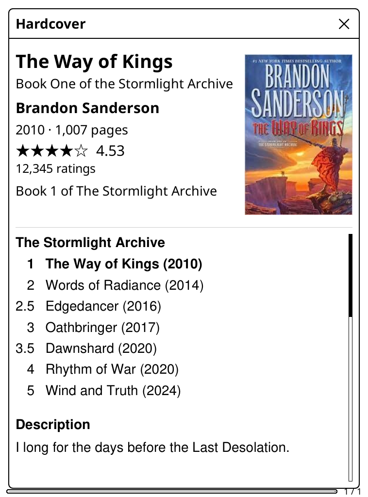
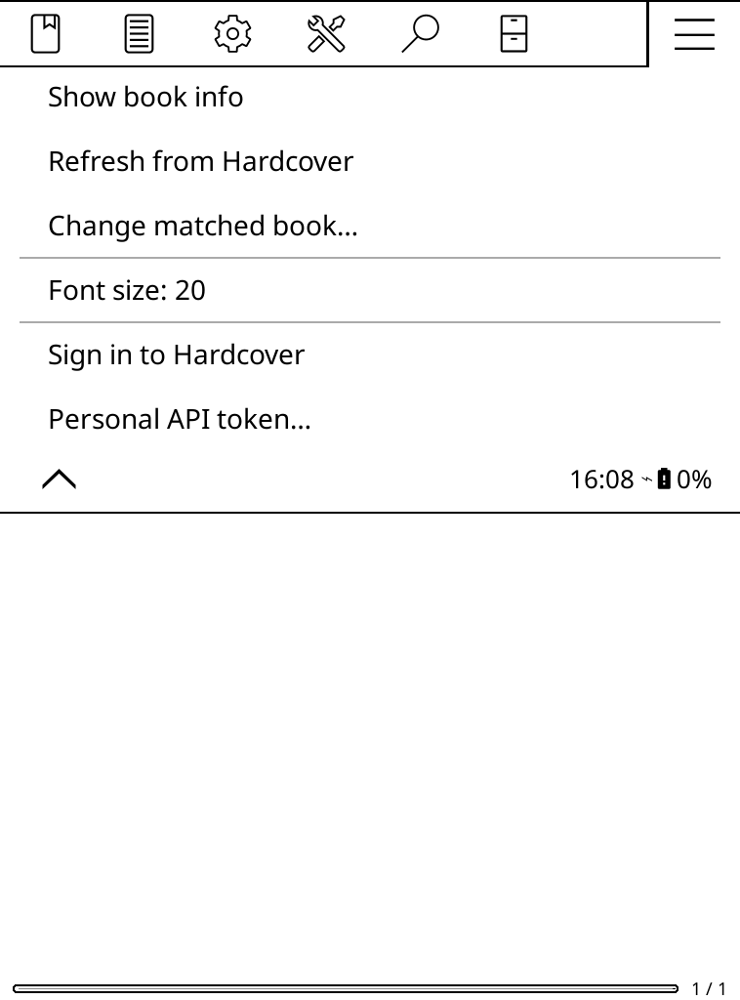

# Hardcover info for KOReader

Shows details of the open book from [Hardcover](https://hardcover.app):

- title and author
- year published
- series, position, and the other books in it
- description
- community rating
- cover

  
  

## Install

Copy `hardcoverinfo.koplugin` into KOReader's `plugins` folder and restart.

## Sign in

**☰ → Hardcover book info → Sign in to Hardcover** shows a code. On a phone or computer, go to <https://hardcover.app/link>, enter the code and approve. The plugin picks up the token automatically and refreshes it as needed. **Sign out** revokes it.

### One-off setup (plugin maintainer)

Sign-in needs a Hardcover OAuth app:

1. Create one under Developer Apps on <https://hardcover.app/account/api>.
   - Application type: *Mobile, desktop, or CLI*
   - Device Authorization Grant: on
   - Scopes: `read:catalog`
2. Put its client ID in `CLIENT_ID` at the top of `hardcoverinfo.koplugin/main.lua` (already set). It is public; no secret is needed.

### Personal token (fallback)

Without a client ID, use a personal token with the `read:catalog` scope (<https://hardcover.app/account/api?scope=read:catalog>): paste it in **Personal API token…** or save it as `hardcoverinfo.koplugin/token.txt`.

## Use

**☰ → Hardcover book info → Show book info** (below *Book information*), or assign the *Hardcover book info* gesture.

**Font size** (default 20) sets the text size of the info screen.

The book is matched by ISBN, then title and author. If unsure, a list of candidates is shown. The match and details are cached per book; use **Refresh** to re-fetch or **Change matched book…** to fix a wrong match.
